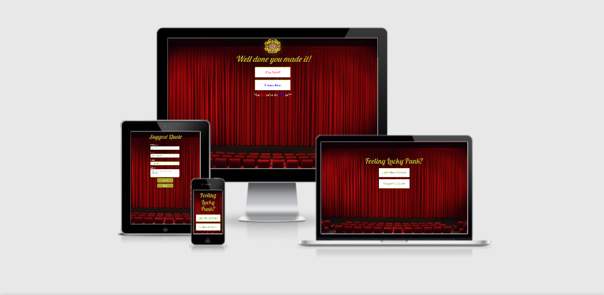

# Movie Quote Guessing Game

I am designing this web application as part of my second Milestone project for Code Institutes diploma in software development course.
The application i am designing is a movie quote guessing game titled "Feeling Lucky Pumk" after the famous Clint Eastwood movie quote. As a fellow movie nerd I aim to provide a fun and interactive game that all movie lovers will enjoy.

# UX
## User Stories
As a user I would like:

* To play a fun interactive guessing game.
* To be both challenged and entertained.
* To come across both familiar and not so familliar movie quotes.
* To be reminded of some classic films and maybe learn of some unknown films.
* To be kept engaged while playing the game.
* To be able to view my score as I play.
* To be visibly notified if i get the answer right or wrong.
* To contact the games creator to suggest my own movie quote ideas.
* To be shown my score during and after the game.
* To know how many questionsare being asked and which question I am currently on.

## Strategy
As previously stated this movie quote guessing game is designed to be a fun and interactive experience for all users. The target audiance is movie lovers and anyone interested in having a bit of fun.
The quotes vary in genre so any user can find some recogniseable quotes from classic films and maybe a few quotes they wouldnt be familliar with.

## Scope
The game is fairly straight forward allowing for a wide variation in users. Every feature added to the game meets the user need requirments and is essential to get the most enjoyment out of the game.

## Structure
In order to really enjoy the the game easy navigation and flow of content was essential. Moving from page to page is done at the click of a button. There are only four main pages and none of them 
are overpopulated with uneccessary content. The home page provides you with two options of playing the game or visitig the quote suggestion form and the the end game page allows you to play again or return to the home page.
With limited options the user can move through the web application with ease.
The simplicitic nature of the game allows the user to focus on the main objective of the web application, having fun!

## Skeleton
The theme of the game was aimed towards the style of an old fashioned theatre. There is something inviting and nostalgic about the feel and colours associated with this theme. 
In order to achieve this effect I used specific colours, backgrounds and fonts that fell inline with the theme. These will be discussed further in the design section.

## Design
**Wire Frames**

 The webpage was designed using Balsamiq to crate some basic wireframes(Link below) 
 
 [Wireframes](wireframes.md)

**Colours**
* I used a blend of dark yeallow/gold(rgb(165, 165, 42)) and red(rgba(197, 23, 0, 0.89)) to coinside with the vintage theatre design that I was attempting to emulate.

* on the end page when you finish the game some of the text is in red and blue. This was chosen to match with the quote from the classic film "The Matrix" that is presented to you at the bottom of the end page.

* Simple black and white colours were used through out the rest of the app so as to make all the content clear and readable for all uses.

**Typography**
* The font I chose for all the headings of the web application was 'Lobster', cursive. I really liked this font as it made the headings really stand out and gave that old fashioned theatre feel that I was aiming for.

* For the quotes them selves I chose something a little different, 'Architects Daughter', cursive. I felt this gave a nice hand written effect and was a fun way to present the quotes.

* The rest of the text I used 'Lato', sans-serif. This text was used mostly in places where users needed to make a choice so I felt this text was clean and readable for all users.

**Backgrounds**
* I used the same background for the home, end and form page. The background in use is an image of a theatre with the curtains drawn. I felt this was a nice effect, as if the user was about to enter a show. The image was sourced from [Clipart Library](http://clipart-library.com/theatre-curtains.html);

* The background for the main game is an image of an old movie projector [Stockvault](https://www.stockvault.net/free-photos/movies) with red clour shaded over it in CSS. I felt the image looked great and the red shading kept inline with the desired theme.
# Features
## Exsisting Features
* Button links to navigate between all four pages of the web application.
* Question count to keep track of what question the user is on.
* Score board to keep track of what score the user is on.
* Four possible answers for the user to choose from.
* A score board on the end page for the users final score.
* A form where the user can suggest movie quotes that they would like to see in the game.

## Features Still to Be Implemented
* A page listing all the movies mentioned in the game with some info on them and links to their IMBD page.

# Technologies Used
## Languages
* [HTML5](https://en.wikipedia.org/wiki/HTML5)
* [CSS3](https://en.wikipedia.org/wiki/CSS)
* [JavaScript](https://javascript.info/)

## Frameworks and Programs
* [Bootstrap 4.5](https://getbootstrap.com/docs/4.3/getting-started/introduction/)
> Used to get the overall layout of the Webpage.

* [Balsamiq](https://balsamiq.com/wireframes/?gclid=Cj0KCQiA48j9BRC-ARIsAMQu3WSc14tIkeDZUlWDIVOa-Acbyn1s5XvsJJ6CnWplwD7_WPcgk-C4cTgaAsaNEALw_wcB)
> I used Balsamiq to make my wireframes.

* [GitHub](https://github.com/)
> GitHub was used to push content to the repository.

*  [TinyPNG](https://tinypng.com/)
> TinyPNG was used to compress my images and files.

*  [W3C CSS Validator](https://jigsaw.w3.org/css-validator/validator)
> CSS code was checked using CSS W3C CSS Validator.

* [Online Beautifier](https://beautifier.io/)
> Online Beautifier was used to beautify my HTML, CSS and JavaScript code.

* [Email.js service](https://www.emailjs.com/docs/tutorial/overview/)
> Email.js api service was used for the form to send quote suggestions to my email adress.

* [W3C Markup Validator](https://validator.w3.org/nu/#textarea)
>W3C Markup Validator was used to check the HTML code.

* [Google Fonts](https://fonts.google.com/)
>All fonts came from Google Fonts.

# Testing

## Functionality Test
Nm | Test | Action | Expected Outcome |Test result |
-- | ---- | ------ | ---------------- |----------- |
#1 | Gmae setup | Load up game from home page. | All questions, answers, score board and question counter are loaded. | Passed |
#2 | Navigtion buttons | Click on each nav button. | Each nav button should direct me to a new page of the web application. | Passed |
#3 | Answer buttons(correct) | Click on correct answers. | The answer should turn green and after a second a new question should be loaded. | Passed |
#4 | Answer buttons(wrong) | Click on correct answers. | The answer should turn red and after a second a new question should be loaded. | Passed |
#5 | Random questions | Play through game multiple times. | Every new game should produce a random order of the possible questions. | Passed |
#6 | Score board(game) | Play through game. | After each correct answer the score board should increment by 10 points. | Passed |
#7 | Score board(end) | Finish the game. | The end page score board should show the players final score. | Passed |
#8 | Form | Enter details to form and click submit. | The form should send the form info to my chosen email. | failed |
#9 | Question counter | Play through the game. | after each question the question counter should increment by one. | Passed |

## Browser Compatibility Test
Nm | Browser | Action | Test result |
-- | ------- | ------ | ----------- |
#1 | Chrome | Open app in browser. | Passed |
#2 | Firefox | Open app in browser. | Passed |
#3 | Safari | Open app in browser. | Passed |

As the webpage was being built Chrome developer tools were used to ensure that the code was working smoothly. Each section was then tested again every time a new feature was added. This was also true for each JavaScript function that was added to the games functionality.

Pre-deployment I checked that the webpage met all the user needs previously stated.

The webpage was tested on multiple viewports each time a section was added or updated to make sure everything was working correctly.
Post-deployment the webpage was tested across a number of devices to ensure it remained responsive. Some of the devices that were tested: Iphone 5, Iphone 11, Samsung A5, Samsung S8, Ipad pro, Samsung Galaxy Tab s7 ,Toshiba laptopand a Huawei 15" laptop.

Post-deployment the webpage was opened and tested on three different search engines

## Bugs

**Resolved**

**Unresolved**
* The form page would automaticlly send an empty email everytime the page was opned or refreshed.

# Deployment
The site was developed using [Gitpod IDE](https://gitpod.io/), the code was then added and comitted to git and pushed to my Github repository.

The site was deployed to GitHub pages. See below for instructions.

* Log on to GitHub repository.
* Click on settings.
* Scroll to GitHub pages.
* Change your source to Branch - Master.
* Hit save.
* Scroll up to find and retrieve the link to your deployed website.

## How to clone this project
## With Gitpod
* Create a Gitpod account and install Gitpod Browser extension for chrome.
* Log into your gitpod account.
* Go to [Github repository](https://github.com/LiamGaff/Liam-Gaffney-Actor) and click on the green "Gitpod" button.
* This will open a new Gitpod workspace created from the code in the github repoitory where you can work.

## Local IDE
* Go to my Github repository [here](https://github.com/LiamGaff/Liam-Gaffney-Actor).
* Under the repository name click on "clone or download"
* In the clone with HTTPs section copy the clone URL for the repository.
* In your local IDE open the terminal and change you directory to where you want the clone to be made.
* In the terminal type _git clone_ and then paste the repoitory URL.
* Press enter and a clone will be created.

# Credits

## Code
* Build a Quiz App by James Quick on Youtube was a major asset to me in building the app. I followed along and learned as i built the game using his guidance then I implemented what I learned to my project.
* The interactive structure and layout of the code  https://getbootstrap.com/docs/4.5/layout/overview/
* Resources such as W3schools and Stackoverflow were used to come up with solutions to various problems I encountered
* Some ideas for the code (Such as the form page) were taken from mini projects done through out the course. 

## Acknowledgements
* I would also like to credit and thank my mentor Brian Macharia for all his help once again. I would have been lost without his guidance so far through out this course. 